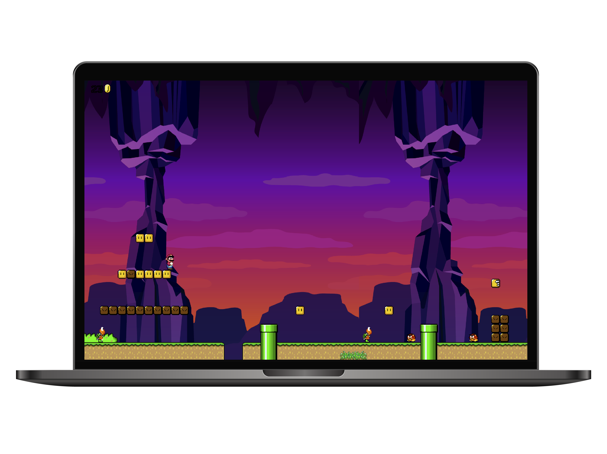

<h2 align="center">
  🍄 Mario Platform Game
</h2>

<div align="center">
  
</div>

<br/>

<div align="center">

[](https://forthebadge.com) &nbsp;
[](https://forthebadge.com) &nbsp;
[](https://forthebadge.com) &nbsp;
[](https://forthebadge.com)

</div>

---

## 🚀 About the Game

Classic 2D platformer inspired by Super Mario Bros with pure JavaScript and jQuery. Jump through levels, defeat enemies, and collect power-ups in this nostalgic side-scrolling adventure!

---

## 🛠 Built With

- **JavaScript** - Core game logic and mechanics  
- **jQuery** - DOM manipulation and animations  
- **HTML5 Canvas** - Rendering game elements  
- **CSS3** - Styling and responsive design  

---

## ✨ Features

- **🏰 Multiple Levels** - Different environments and challenges  
- **🍄 Power-up System** - Mushrooms, flowers, and stars  
- **👾 Various Enemies** - Goombas, turtles, piranha plants  
- **🎵 Sound Effects** - Classic game sounds and music  
- **📈 Score Tracking** - Coin and life counters  

---

## ⚡ Getting Started

### 1️⃣ Clone the repository

```bash
git clone https://github.com/dv0retsky/mario-game.git
```

### 2️⃣ Open in browser

```bash
open index.html  # MacOS
start index.html # Windows
```

### 3️⃣ Alternative: Run with live server

```bash
npx live-server
```

##  🎮 How to Play
- ← → Arrow Keys: Move left/right
- ↑ Arrow Key: Jump
- ↓ Arrow Key: Crouch (when big)
- Space: Shoot fireballs (with flower power-up)
- Avoid enemies or jump on them to defeat
- Collect coins for extra lives
---

<div align="center"> Made with ❤️ by <b>dv0retsky</b> </div>
